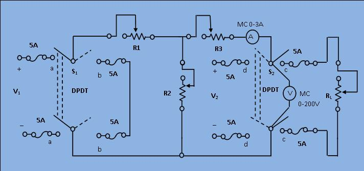

### Procedure

								
&nbsp;

								 <figure style="text-align:center">
									 
									  <figcaption>[Fig 1: Circuit diagram for Experimental set-up for verification of Thevenin's theorem]</figcaption>
								</figure> 
								
&nbsp;

								
1) &nbsp;Keep all the resistance close to their maximum respective values.

								
2) &nbsp;Close the switch S1 to "aa" and S2 to "cc" positions. Observe the load current (IL) and voltage (VL) readings. The load resistance

								

								

								$$R_{L}=\frac{V_L}{I_L}$$
								
 
								
3) &nbsp;Remove the load by opening the switch S2 and read the open circuit voltage (or Thevenin equivalent voltage) Vth.

								
 
								4) &nbsp;Next, compute the resistance (RTH) of the network as seen from the load terminals,&nbsp;

								
&nbsp; &nbsp; &nbsp;

								
&nbsp; &nbsp; a) Replace the &nbsp;220 V source by a short by closing S1 to "bb".

								
&nbsp; &nbsp; &nbsp;&nbsp;

								
&nbsp; &nbsp; &nbsp;b) Apply 110 V at the output terminals by closing S2 to "dd". Read the voltmeter (V) and ammeter (I) and get

								
&nbsp;&nbsp;&nbsp; &nbsp; &nbsp; &nbsp; &nbsp; &nbsp; &nbsp; &nbsp; &nbsp; &nbsp; &nbsp; &nbsp; &nbsp; &nbsp; &nbsp; &nbsp; &nbsp; &nbsp;&nbsp;<o:p></o:p>

								

								$$R_{th}=\frac{V}{I}$$
								
 
								
&nbsp;

								
5) Now compute the load current. Applying Thevenin theorem

								

								$$I_{L}=\frac{V_{th}}{R_{th}+R_{L}}$$
								
 
								
6) Compare the above computed load current with its observed value in step (2) and verify the theorem. &nbsp; &nbsp; &nbsp; &nbsp; &nbsp; &nbsp; &nbsp; &nbsp; &nbsp; &nbsp; &nbsp; &nbsp; &nbsp; &nbsp; &nbsp; &nbsp; &nbsp; &nbsp;

								
<o:p>&nbsp;</o:p>

								
<o:p>&nbsp;</o:p>

								
&nbsp;

								
&nbsp;

							
            