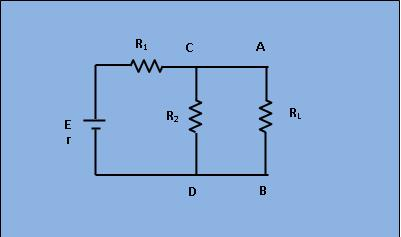

### Theory

Its provides a mathematical technique for replacing a given network, as viewed from two terminals, by a single voltage source with a series resistance. It makes the solution of complicated networks quite quick and easy. The application of this extremly useful theorem will be explained with the help of following simple example.

 <figure style="text-align:center">

<figcaption>[Fig 1: Circuit with source E and Load RL]
</figcaption>
</figure>
 
 

&nbsp;Suppose, it is required to find current flowing through load resistance RL, as shown in figure 1.

&nbsp;

This expression proceed as under:

&nbsp;

1) Remove RL from the circuit terminals A and B and redraw the circuit as shown in figure 2. Obviously, the terminal have become open circuited.

&nbsp;

 <figure style="text-align:center">

<figcaption>[Fig 2: Circuit with RL removed.]</figcaption>
</figure>

&nbsp; &nbsp; &nbsp; &nbsp; &nbsp; &nbsp; &nbsp; &nbsp; &nbsp; &nbsp; &nbsp; &nbsp; &nbsp; &nbsp; &nbsp; &nbsp; &nbsp; &nbsp; &nbsp; &nbsp; &nbsp; &nbsp; &nbsp; &nbsp; &nbsp; &nbsp; &nbsp; &nbsp; &nbsp;&nbsp;

&nbsp;

2) Calculate the open circuit Voltages VO.C. which appears across terminals A and B when they are open .ie. when RL is removed.

&nbsp;

As seen, V.O.C.= drop across R2= IR2 where I is the circuit current when A and B is open.

$$I=\frac{E}{r + R_1+R_2}$$
$$V_{o.c.}= I*R_1$$
$$V_{o.c.} & = \frac{E*R_2}{r + R_1+R_2}$$

&nbsp;It is also called Thevenin voltage(Vth).

&nbsp;&nbsp;

3) Now, imagine the battery to be removed from the circuit, leaving its internal resistance r behind and redraw the circuit as shown in figure 3.

&nbsp;

 <figure style="text-align:center">

<figcaption>[Fig 3: Circuit with RL and E removed]
</figcaption>
</figure>

&nbsp;

&nbsp;

When viewed inwards from the terminals A and B, the circuit consists of two parallel paths: one containing R2 and another containing (R1+r). The equivalent resistance of the network as viewed from these terminals is given as,

$$R_{th}=\frac{(R_1+r)*R_2}{R_1+r+R_2}$$
 

The resistance "Rth" is also called Thevenin equivalent resistance.

&nbsp;

Consequently , as viewed from terminals A and B, the whole network (excluding R1) can be reduced to single source (called thevenin&#039;s source) whose e.m.f equal to VO.C. and whose internal reistance equal to Rth as shown in figure 4. &nbsp; 

&nbsp;

4) RL is now connected back across terminals A and B from where it was temporaily removed earlier. Current flowing through RL is given by,&nbsp;

$$I_{1}=\frac{V_{th}}{R_{th}+R_L}$$
 

 <figure style="text-align:center">

 <figcaption>
 [Fig 4: Thevenin's equivalent circuit]
</figcaption>
</figure>
 
 
 

                            

